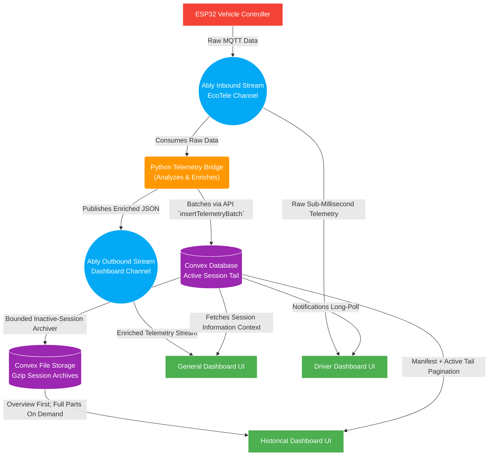
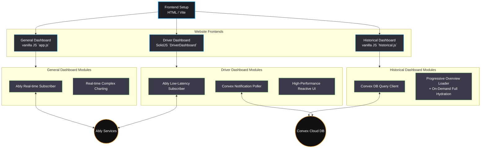
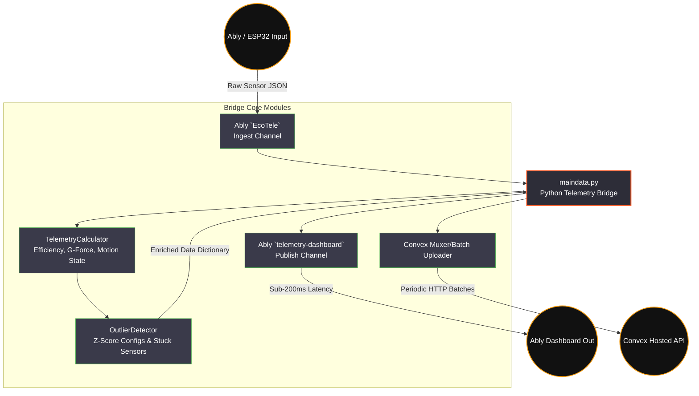

# 🏛️ Architecture Analysis: EcoVolt Telemetry Dashboard

The repository implements a highly decoupled, real-time telemetry processing architecture. The system relies heavily on **Ably** for ultra-low latency Pub/Sub and **Convex** for serverless persistent storage.

## 1. Full Stack Data Flow

The architecture embraces a "Compute ONCE" mindset. Intensive computations are handled by the Python bridge, ensuring web instances act as thin clients that only consume and render data.

### Key Architectural Concepts
1. **Zero-Processing Latency for Driver:** By having the Driver Dashboard tap straight into the `Ably Inbound Stream` (the exact same channel the ESP32 publishes to), the system completely removes the Python array processing, Z-score calculations, and network hops of the Bridge from the driver's critical path.
2. **Dual-Sourcing for General Dashboard:** The General Dashboard leverages both **Convex** (to load session state and the active database tail upon initialization) and the **Ably Outbound Stream** (to parse the enriched mathematical derivations constructed by `maindata.py`).
3. **Hot/Cold Historical Storage:** Telemetry remains as indexed database documents while a session is active. After 30 minutes of inactivity, a bounded internal cron action writes ordered 3,000-record gzip parts to Convex File Storage, atomically records each part in `telemetryArchives`, and removes the corresponding wide database documents.
4. **Progressive Historical Resolution:** Every archived part also produces a tiny preview and exact aggregate summary. Finalization consolidates them into one gzip overview capped at 1,500 representative points. Opening a session downloads only this overview, and browsing or focusing session cards performs no data fetch. Collapsed modules perform no rendering; charts, energy, driver, map, table preview, and comparisons use overview data; distribution statistics, anomaly analysis, regression, segmentation, custom analysis, and exports request full archive parts only when invoked. Active and not-yet-archived sessions use a bounded 1,500-record database preview rather than a full scan.

---

## 2. Website Architecture

The frontend avoids a monolithic approach, instead opting for purpose-built "instances" depending on the specific use case of the team member.

**Instance Workflows:**
*   **General Dashboard (`app.js`):** Engineered for the pit crew. It connects directly to an **Ably** channel (`telemetry-dashboard-channel`). It retains a rolling window of telemetry data tightly coupled with charting libraries to display live anomalies and efficiency metrics. It queries Convex primarily for historical context and session boundaries.
*   **Driver Dashboard (`DriverDashboard.tsx`):** A modern, mobile-optimized UI. It uses **SolidJS** to avoid heavy DOM reconciliations and maintains absolute minimal latency. It uses a **hybrid networking approach**: it connects to **Ably** directly against the inbound stream for instantaneous raw telemetry (speed, G-force, deltas), whilst simultaneously running a lightweight polling function against **Convex** to fetch critical team notifications and flags asynchronously. 
*   **Historical Dashboard (`historical.js`):** Designed for deep, post-race analysis. It drops the Ably WebSocket connection completely and interfaces exclusively with **Convex**. Its default payload is a single compressed level-of-detail overview with exact session KPIs. Full gzip parts remain available for operations that need every sample, but are hydrated once and only on explicit demand. Cursor pagination remains as a deployment-compatibility fallback; normal session opens never scan the full telemetry table.

---

## 3. Backend Architecture (`maindata.py`)

The backend focuses on high-frequency stream processing. Instead of the vehicle talking directly to a database, it talks to a "Bridge" constructed in Python (`maindata.py`), which orchestrates data enhancement before it hits the clients.

**Backend Modules:**
*   **Ingestion:** The Bridge listens to the raw ESP32 data entering via **Ably** (`EcoTele` channel). 
*   **Real-time Calculations (`TelemetryCalculator`):** Rather than forcing mobile browsers to run math, the Python bridge offloads the work. It takes raw speeds and currents and actively computes the motion state (cruising, braking), active G-force estimates, cumulative energy, and optimal speed efficiencies in rolling arrays.
*   **Anomaly Detection (`OutlierDetector`):** It runs NumPy-based statistical analysis across rolling windows, checking for erratic jumps, impossible GPS positions, and explicitly marks `outliers` with severity keys before transmitting.
*   **Separation of Duties:** 
    *   **Live Path:** The mutated JSON data is instantly republished to a *different* **Ably** channel meant for consumption by the UI instances (e.g. General Dashboard).
    *   **Cold Path:** The exact same enhanced arrays are queued, throttled into batches, and pushed out to **Convex** via `insertTelemetryBatch` to securely mutate the serverless document graph continuously.
