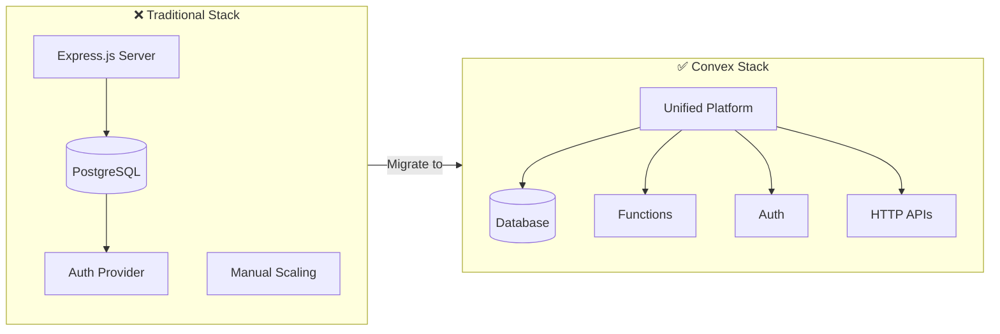
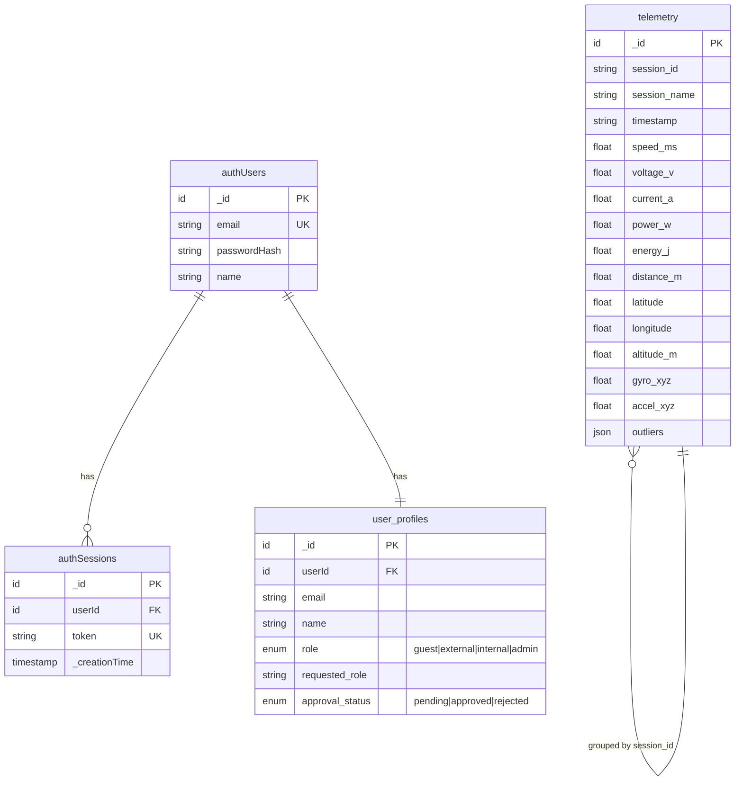
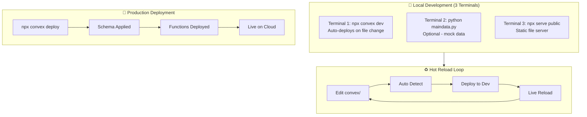

# Convex Setup Guide for TelemetryDashboard

This guide explains how to set up Convex as the backend for the EcoVolt Telemetry Dashboard. Convex provides real-time database functionality, serverless functions, and handles authentication.

## Why Convex?



| Traditional Stack | Convex |
|-------------------|--------|
| Multiple services to manage | Single unified platform |
| Manual scaling | Auto-scaling |
| Complex deployments | One command deploy |
| Polling for updates | Real-time subscriptions |
| Custom auth setup | Built-in auth patterns |

## Table of Contents

1. [Prerequisites](#prerequisites)
2. [Creating a Convex Project](#creating-a-convex-project)
3. [Environment Variables](#environment-variables)
4. [Schema Overview](#schema-overview)
5. [Deploying to Convex](#deploying-to-convex)
6. [Authentication System](#authentication-system)
7. [Connecting the Frontend](#connecting-the-frontend)
8. [Connecting the Python Bridge](#connecting-the-python-bridge)
9. [Vercel Deployment](#vercel-deployment)
10. [Troubleshooting](#troubleshooting)

---

## Prerequisites

- Node.js 18+ installed
- npm or yarn package manager
- A Convex account (free tier available at [convex.dev](https://convex.dev))
- An Ably account for real-time telemetry streaming (free tier at [ably.com](https://ably.com))

---

## Creating a Convex Project

### Step 1: Sign Up / Log In to Convex

1. Go to [dashboard.convex.dev](https://dashboard.convex.dev)
2. Sign up with GitHub, Google, or email
3. You'll be taken to your Convex dashboard

### Step 2: Initialize Convex in Your Project

In your TelemetryDashboard directory:

```bash
npx convex dev
```

This will:
1. Prompt you to log in (if not already)
2. Ask you to create a new project or link to an existing one
3. Deploy your schema and functions
4. Start the development server with hot-reloading

### Step 3: Get Your Deployment URL

After the project is created, you'll see your deployment URL in the format:
```
https://your-project-name-123.convex.cloud
```

Copy this URL - you'll need it for frontend configuration.

---

## Environment Variables

### Convex Dashboard Environment Variables

In the Convex dashboard, go to **Settings > Environment Variables** and add:

| Variable | Description | Required |
|----------|-------------|----------|
| `ABLY_API_KEY` | Your Ably API key for token generation | Yes (for token auth) |

### Frontend Configuration (public/index.html)

The frontend configuration is set in `public/index.html`:

```html
<script>
  window.CONFIG = {
    ABLY_CHANNEL_NAME: "telemetry-dashboard-channel",
    // Option 1: Direct API key (simpler, but exposes key in client)
    ABLY_API_KEY: "your-ably-api-key",
    // Option 2: Use Convex HTTP endpoint for token auth (more secure)
    // ABLY_AUTH_URL: "https://your-project.convex.site/ably/token",
    CONVEX_URL: "https://your-project-name-123.convex.cloud",
  };
</script>
```

> **Security Note**: In production, prefer using `ABLY_AUTH_URL` instead of exposing `ABLY_API_KEY` in client-side code. Set the API key in Convex environment variables instead.

---

## Schema Overview

The Convex schema is defined in `convex/schema.ts`. Here's what each table stores:



**Indexes:**
- `telemetry`: `by_session`, `by_session_timestamp`
- `authUsers`: `by_email`
- `authSessions`: `by_token`, `by_userId`
- `user_profiles`: `by_userId`, `by_email`, `by_approval_status`

### Telemetry Table

Stores all vehicle sensor data:

```typescript
telemetry: defineTable({
  session_id: v.string(),           // Unique session identifier
  session_name: v.optional(v.string()),
  timestamp: v.string(),            // ISO 8601 timestamp
  speed_ms: v.optional(v.number()),
  voltage_v: v.optional(v.number()),
  current_a: v.optional(v.number()),
  power_w: v.optional(v.number()),
  energy_j: v.optional(v.number()),
  distance_m: v.optional(v.number()),
  latitude: v.optional(v.number()),
  longitude: v.optional(v.number()),
  altitude_m: v.optional(v.number()),
  gyro_x: v.optional(v.number()),
  gyro_y: v.optional(v.number()),
  gyro_z: v.optional(v.number()),
  accel_x: v.optional(v.number()),
  accel_y: v.optional(v.number()),
  accel_z: v.optional(v.number()),
  total_acceleration: v.optional(v.number()),
  message_id: v.optional(v.number()),
  uptime_seconds: v.optional(v.number()),
  throttle_pct: v.optional(v.number()),
  brake_pct: v.optional(v.number()),
  data_source: v.optional(v.string()),
  outliers: v.optional(v.any()),    // Outlier detection data from Python
})
  .index("by_session", ["session_id"])
  .index("by_session_timestamp", ["session_id", "timestamp"])
```

### Auth Tables

Custom authentication tables for email/password auth:

```typescript
authUsers: defineTable({
  email: v.string(),
  passwordHash: v.string(),
  name: v.optional(v.string()),
}).index("by_email", ["email"])

authSessions: defineTable({
  userId: v.id("authUsers"),
  token: v.string(),
})
  .index("by_token", ["token"])
  .index("by_userId", ["userId"])
```

### User Profiles Table

Extends auth with app-specific data and role management:

```typescript
user_profiles: defineTable({
  userId: v.id("authUsers"),        // Reference to authUsers table
  email: v.string(),
  name: v.optional(v.string()),
  role: v.union(
    v.literal("guest"),
    v.literal("external"),
    v.literal("internal"),
    v.literal("admin")
  ),
  requested_role: v.optional(v.string()),
  approval_status: v.union(
    v.literal("pending"),
    v.literal("approved"),
    v.literal("rejected")
  ),
})
  .index("by_userId", ["userId"])
  .index("by_email", ["email"])
  .index("by_approval_status", ["approval_status"])
```

---

## Deploying to Convex

### Development Workflow



### Development Mode

Run the development server with hot-reloading:

```bash
npx convex dev
```

This watches for changes in the `convex/` directory and automatically deploys.

### Production Deployment

Deploy to production:

```bash
npx convex deploy
```

### Viewing Logs

In the Convex dashboard:
1. Go to your project
2. Click **"Logs"** in the sidebar
3. View real-time function execution logs

### Viewing Data

In the Convex dashboard:
1. Go to your project
2. Click **"Data"** in the sidebar
3. Browse tables and records
4. Use the query editor for custom queries

---

## Authentication System

The dashboard uses a custom email/password authentication system built in Convex.

### How It Works

1. **Sign Up**: User provides email, password, and optional name
2. **Password Hashing**: SHA-256 hash with salt stored in `authUsers`
3. **Session Token**: Random 32-byte hex token stored in `authSessions`
4. **Token Storage**: Client stores token in localStorage
5. **Session Expiry**: Tokens expire after 24 hours

### Authentication Flow

```javascript
// Sign up
const result = await ConvexAuth.signIn('password', {
  email: 'user@example.com',
  password: 'securepassword',
  flow: 'signUp',
  name: 'User Name'
});

// Sign in
const result = await ConvexAuth.signIn('password', {
  email: 'user@example.com',
  password: 'securepassword'
});

// Sign out
await ConvexAuth.signOut();
```

### Creating the First Admin User

1. Sign up through the dashboard UI
2. Go to Convex Dashboard → Data → `user_profiles`
3. Find your user's row
4. Change `role` to `"admin"`
5. Change `approval_status` to `"approved"`
6. Refresh the dashboard

---

## Connecting the Frontend

The frontend connects to Convex via the `ConvexBridge` module in `public/lib/convex-bridge.js`.

### Initialization

The bridge is initialized in `app.js`:

```javascript
const CONVEX_URL = window.CONFIG?.CONVEX_URL || "";

let convexEnabled = false;
if (CONVEX_URL && window.ConvexBridge) {
  convexEnabled = await ConvexBridge.init(CONVEX_URL);
}
```

### Available Methods

```javascript
// List all sessions
const { sessions } = await ConvexBridge.listSessions();

// Get all records for a session
const records = await ConvexBridge.getSessionRecords(sessionId);

// Get recent records (with limit)
const recent = await ConvexBridge.getRecentRecords(sessionId, sinceTimestamp, limit);

// Get latest timestamp (for gap detection)
const { timestamp, recordCount } = await ConvexBridge.getLatestSessionTimestamp(sessionId);

// Subscribe to real-time updates (reactive)
const unsubscribe = ConvexBridge.subscribeToSession(sessionId, (records) => {
  console.log('Data updated:', records.length, 'records');
});

// Clean up subscription
unsubscribe();
```

---

## Connecting the Python Bridge

The Python `maindata.py` bridge sends telemetry data to both Ably (for real-time) and Convex (for persistence).

### Required Python Packages

```bash
pip install convex ably numpy
```

### Configuration in maindata.py

```python
# Convex configuration
CONVEX_URL = "https://your-project-name-123.convex.cloud"

# Ably configuration
DASHBOARD_ABLY_API_KEY = "your-ably-api-key"
DASHBOARD_CHANNEL_NAME = "telemetry-dashboard-channel"
```

### Data Flow

1. **Data Source** → ESP32 serial or mock data generator
2. **Processing** → NumPy-based outlier detection
3. **Ably Publish** → Real-time streaming to dashboard
4. **Convex Insert** → Persistent storage via `telemetry:insertTelemetryBatch`
5. **Local Journal** → NDJSON backup file

---

## Vercel Deployment

### vercel.json Configuration

```json
{
  "version": 2,
  "buildCommand": "echo 'Static build complete'",
  "outputDirectory": "public",
  "headers": [
    {
      "source": "/(.*)",
      "headers": [
        { "key": "X-Content-Type-Options", "value": "nosniff" },
        { "key": "X-Frame-Options", "value": "DENY" }
      ]
    }
  ]
}
```

### Deploy Steps

1. **Deploy Convex first:**
```bash
npx convex deploy
```

2. **Update frontend config** with production Convex URL

3. **Deploy to Vercel:**
```bash
vercel --prod
```

---

## Troubleshooting

### "Convex not initialized" Error

**Cause**: The Convex URL is missing or incorrect.

**Solution**:
1. Check `window.CONFIG.CONVEX_URL` in browser console
2. Verify the URL matches your Convex deployment
3. Ensure the Convex browser bundle is loaded before `convex-bridge.js`

### "Failed to fetch sessions" Error

**Cause**: Network issue or Convex deployment not running.

**Solution**:
1. Check if `npx convex dev` is running (for development)
2. Verify your Convex deployment is active in the dashboard
3. Check browser network tab for failed requests

### Authentication Not Working

**Cause**: Session token expired or invalid.

**Solution**:
1. Clear localStorage and sign in again
2. Check Convex logs for auth errors
3. Verify the auth functions are deployed

### Data Not Persisting

**Cause**: Python bridge not connected to Convex.

**Solution**:
1. Check `CONVEX_URL` in `maindata.py`
2. Verify Convex deployment is running
3. Check Python console for connection errors
4. Ensure `convex` Python package is installed

### Real-time Updates Not Working

**Cause**: Ably connection issue.

**Solution**:
1. Verify `ABLY_API_KEY` is configured correctly
2. Check browser console for Ably connection errors
3. Ensure channel name matches between Python bridge and frontend

---

## Quick Start Checklist

- [ ] Create Convex account and project
- [ ] Run `npx convex dev` to deploy schema
- [ ] Copy deployment URL to `public/index.html`
- [ ] Set `ABLY_API_KEY` in Convex environment variables
- [ ] Configure Python bridge with Convex URL
- [ ] Run `python backend/maindata.py` to start data bridge
- [ ] Open dashboard and click Connect
- [ ] Verify data is flowing (messages count increasing)

---

## Resources

- **Convex Documentation**: [docs.convex.dev](https://docs.convex.dev)
- **Convex Discord**: [discord.gg/convex](https://discord.gg/convex)
- **Ably Documentation**: [ably.com/docs](https://ably.com/docs)

---

*Last updated: January 2026*
