# Deployment Guide

This guide walks you through deploying the Telemetry Dashboard with Convex backend and Vercel frontend hosting.

## Architecture Overview

The deployment consists of two parts:
1. **Convex Cloud** - Backend (database, serverless functions, authentication)
2. **Vercel** - Frontend hosting (static files)

```mermaid
flowchart TB
    subgraph Cloud["☁️ Cloud Infrastructure"]
        subgraph Convex["Convex Cloud"]
            DB[(Database<br/>NoSQL)]
            Functions[Serverless<br/>Functions]
            Auth[Authentication<br/>Sessions]
            HTTP[HTTP Actions<br/>Ably Tokens]
        end

        subgraph Vercel["Vercel"]
            Static[Static Files<br/>HTML/JS/CSS]
            CDN[CDN Edge<br/>Global Delivery]
        end
    end

    subgraph Local["🖥️ Local / On-Premise"]
        subgraph PythonBridge["Python Bridge"]
            Ingestion[ESP32 Data<br/>Ingestion]
        end

        subgraph Browser["Browser"]
            Dashboard[Dashboard UI<br/>Real-time Visualization]
        end
    end

    Convex <-->|HTTPS| Vercel
    PythonBridge -->|Mutations| Convex
    PythonBridge -->|Ably Pub/Sub| Browser
    Vercel -->|Static Assets| Browser
    Convex -->|Queries & Auth| Browser
```



### Deployment Flow

```mermaid
flowchart LR
    subgraph Step1["Step 1"]
        A1[npx convex deploy] --> A2[Schema Applied]
        A2 --> A3[Functions Deployed]
    end

    subgraph Step2["Step 2"]
        B1[Update index.html] --> B2[Set CONVEX_URL]
        B2 --> B3[Set ABLY config]
    end

    subgraph Step3["Step 3"]
        C1[vercel --prod] --> C2[Build Static]
        C2 --> C3[Deploy to CDN]
    end

    Step1 --> Step2 --> Step3 --> D[🎉 Live Dashboard]
```



## Prerequisites

Before deploying, make sure you have:

1. A [Convex account](https://convex.dev) (free tier works)
2. A [Vercel account](https://vercel.com/signup) (free tier works)
3. An [Ably account](https://ably.com) with API key
4. Your repository pushed to GitHub (for Vercel auto-deploy)

## Part 1: Deploy Convex Backend

### Step 1: Install Dependencies

```bash
npm install
```

### Step 2: Log in to Convex

```bash
npx convex login
```

### Step 3: Deploy to Production

```bash
npx convex deploy
```

This will:
- Create or update your Convex deployment
- Deploy all functions from `convex/` directory
- Apply schema changes to the database

### Step 4: Get Your Deployment URLs

After deployment, you'll have two URLs:
- **Convex Cloud URL**: `https://your-project.convex.cloud` (for queries/mutations)
- **Convex Site URL**: `https://your-project.convex.site` (for HTTP endpoints)

### Step 5: Set Environment Variables

```mermaid
flowchart TB
    subgraph ServerSide["🔒 Server-Side (Convex Dashboard)"]
        direction TB
        S1[ABLY_API_KEY] --> S2[DxuYSw.xxxxx:xxxxxxxx]
        S3[⚠️ Never expose in frontend!]
    end

    subgraph ClientSide["✅ Client-Side (index.html)"]
        direction TB
        C1["CONVEX_URL"] --> C2["https://your-project.convex.cloud"]
        C3["ABLY_AUTH_URL"] --> C4["https://your-project.convex.site/ably/token"]
        C5["ABLY_CHANNEL_NAME"] --> C6["telemetry-dashboard-channel"]
    end

    ServerSide -.->|"❌ Never Copy"| ClientSide
```



> **Security Note**: Server-side secrets stay in Convex environment variables. Only public URLs go in the frontend config.

In Convex Dashboard → Settings → Environment Variables, add:

| Variable | Description | Where to Get It |
|----------|-------------|-----------------|
| `ABLY_API_KEY` | Ably API key for token generation | [Ably Dashboard](https://ably.com/dashboard) → Your App → API Keys |

---

## Part 2: Deploy Frontend to Vercel

### Option A: Deploy via Vercel Dashboard (Recommended)

1. **Push your code to GitHub**
```bash
git push origin main
```

2. **Go to Vercel Dashboard**
   - Visit [vercel.com](https://vercel.com)
   - Click "Add New..." → "Project"

3. **Import Your Repository**
   - Click "Import" next to your GitHub repository
   - If you don't see it, configure GitHub permissions

4. **Configure Your Project**
   - **Framework Preset**: Other
   - **Root Directory**: `./`
   - **Build Command**: Leave as default
   - **Output Directory**: `public`

5. **Deploy**
   - Click "Deploy"
   - Wait 1-2 minutes for deployment
   - Your app will be live at `https://your-project.vercel.app`

### Option B: Deploy via Vercel CLI

1. **Install Vercel CLI**
```bash
npm install -g vercel
```

2. **Login to Vercel**
```bash
vercel login
```

3. **Deploy**
```bash
vercel
```

4. **Deploy to Production**
```bash
vercel --prod
```

---

## Part 3: Configure Frontend for Production

### Update public/index.html

Before deploying, update the configuration in `public/index.html`:

```html
<script>
  window.CONFIG = {
    ABLY_CHANNEL_NAME: "telemetry-dashboard-channel",
    // For production, use token auth (more secure):
    ABLY_AUTH_URL: "https://your-project.convex.site/ably/token",
    // Your Convex deployment URL:
    CONVEX_URL: "https://your-project.convex.cloud",
  };
</script>
```

### Security Recommendation

For production:
1. Remove `ABLY_API_KEY` from frontend code
2. Use `ABLY_AUTH_URL` pointing to Convex HTTP endpoint
3. Set `ABLY_API_KEY` in Convex environment variables only

---

## Part 4: Configure Python Bridge

### Update backend/maindata.py

```python
# Production Convex URL
CONVEX_URL = "https://your-project.convex.cloud"

# Ably configuration
DASHBOARD_ABLY_API_KEY = "your-ably-api-key"
DASHBOARD_CHANNEL_NAME = "telemetry-dashboard-channel"
```

### Deploy Python Bridge

The Python bridge runs on your local machine or a server (e.g., Raspberry Pi connected to ESP32):

```bash
pip install convex ably numpy
python backend/maindata.py
```

---

## Post-Deployment Verification

### 1. Test Convex Health

```bash
curl https://your-project.convex.site/health
```

Expected response:
```json
{"ok":true,"time":"2026-01-19T..."}
```

### 2. Test Frontend

Visit your Vercel URL and verify:
- [ ] Page loads without errors
- [ ] Convex connection indicator shows connected
- [ ] Sign up/sign in works
- [ ] Sessions list loads (may be empty)

### 3. Test Data Flow

1. Start Python bridge
2. Click "Connect" in dashboard
3. Verify:
   - Messages count increases
   - Gauges show data
   - Data persists after page refresh

---

## Custom Domain (Optional)

### Vercel Custom Domain

1. In Vercel Dashboard → Your Project → Settings → Domains
2. Add your custom domain
3. Follow DNS configuration instructions
4. Wait for DNS propagation (up to 48 hours)

### Convex Custom Domain

Convex HTTP endpoints can also use custom domains:
1. Go to Convex Dashboard → Settings → HTTP Actions
2. Configure custom domain for your site URL

---

## Monitoring & Logs

### Convex Logs

1. Go to [dashboard.convex.dev](https://dashboard.convex.dev)
2. Select your project → Logs
3. View real-time function execution logs

### Vercel Logs

1. Go to Vercel Dashboard → Your Project
2. Click "Deployments" → Select a deployment
3. Click "View Function Logs"

### Ably Stats

1. Go to [ably.com/dashboard](https://ably.com/dashboard)
2. Select your app → Stats
3. View message counts and channel activity

---

## Updating Your Deployment

### Update Convex Backend

```bash
# Deploy updated functions
npx convex deploy
```

### Update Vercel Frontend

**Automatic**: Push to your connected Git branch
```bash
git add .
git commit -m "Update frontend"
git push origin main
```

**Manual**: Deploy via CLI
```bash
vercel --prod
```

### Rollback

**Convex**: Use the deployment history in dashboard

**Vercel**: 
1. Go to Deployments
2. Find a previous working deployment
3. Click "..." → "Promote to Production"

---

## Production Checklist

Before going live:

- [ ] Convex deployed to production
- [ ] Vercel deployed to production
- [ ] `ABLY_API_KEY` set in Convex environment variables
- [ ] Frontend using `ABLY_AUTH_URL` (not raw API key)
- [ ] Frontend `CONVEX_URL` pointing to production
- [ ] Health endpoint responding
- [ ] Authentication working (sign up, sign in, sign out)
- [ ] Real-time connection working
- [ ] Historical data loads correctly
- [ ] GPS visualization displays on map
- [ ] Charts render properly
- [ ] Data export functionality works
- [ ] First admin user created

---

## Troubleshooting

### Convex Deployment Fails

- Check for TypeScript errors in `convex/` files
- Verify schema is valid
- Run `npx convex dev` locally to see detailed errors

### Frontend Not Connecting to Convex

- Verify `CONVEX_URL` in `public/index.html`
- Check browser console for CORS errors
- Ensure Convex deployment is active

### Ably Connection Fails

- Verify `ABLY_API_KEY` in Convex environment variables
- Check `ABLY_AUTH_URL` is correct
- Test token endpoint: `curl https://your-project.convex.site/ably/token`

### Data Not Persisting

- Check Python bridge console for errors
- Verify Convex URL in `maindata.py`
- Check Convex dashboard → Data to see records

---

## Support & Resources

- [Convex Documentation](https://docs.convex.dev)
- [Vercel Documentation](https://vercel.com/docs)
- [Ably Documentation](https://ably.com/docs)

---

*Last updated: January 2026*
