# Quick Start: Deploy in 5 Minutes

This is a quick reference guide. For detailed instructions, see [DEPLOYMENT.md](./DEPLOYMENT.md).

```mermaid
flowchart LR
    subgraph Timeline["⚡ 5-Minute Deployment"]
        S1["1️⃣ Convex<br/>Deploy<br/><i>1 min</i>"]
        S2["2️⃣ Env<br/>Vars<br/><i>30 sec</i>"]
        S3["3️⃣ Config<br/>URLs<br/><i>30 sec</i>"]
        S4["4️⃣ Vercel<br/>Deploy<br/><i>1 min</i>"]
        S5["5️⃣ 🎉<br/>Live!"]
    end

    S1 --> S2 --> S3 --> S4 --> S5
```



## Prerequisites

Have these ready:
- **Convex Account**: Sign up at [convex.dev](https://convex.dev) (free)
- **Ably API Key**: From [Ably Dashboard](https://ably.com/dashboard)
- **Vercel Account**: Sign up at [vercel.com](https://vercel.com) (free)

---

## Step 1: Deploy Convex Backend

```bash
# Install dependencies
npm install

# Deploy to Convex (will prompt to log in)
npx convex deploy
```

Copy your deployment URL: `https://your-project.convex.cloud`

---

## Step 2: Set Environment Variables

In Convex Dashboard → Settings → Environment Variables:

| Variable | Value |
|----------|-------|
| `ABLY_API_KEY` | Your Ably API key |

---

## Step 3: Configure Frontend

Edit `public/index.html` and update the CONFIG:

```html
<script>
  window.CONFIG = {
    ABLY_CHANNEL_NAME: "telemetry-dashboard-channel",
    ABLY_AUTH_URL: "https://your-project.convex.site/ably/token",
    CONVEX_URL: "https://your-project.convex.cloud",
  };
</script>
```

---

## Step 4: Deploy to Vercel

**Option A: Vercel Dashboard (Easiest)**

1. Go to [vercel.com](https://vercel.com)
2. Click "Add New..." → "Project"
3. Import your GitHub repository
4. Set output directory to `public`
5. Click "Deploy"
6. Done!

**Option B: Vercel CLI**

```bash
# Install Vercel CLI
npm install -g vercel

# Login
vercel login

# Deploy to production
vercel --prod
```

---

## Step 5: Verify Deployment

Visit your deployment URL:
- Homepage: `https://your-project.vercel.app`
- Health check: `https://your-project.convex.site/health`

Should show: `{"ok":true,"time":"..."}`

---

## Step 6: Create First Admin User

1. Sign up through the dashboard UI
2. Go to Convex Dashboard → Data → `user_profiles`
3. Find your row, change `role` to `"admin"`
4. Change `approval_status` to `"approved"`
5. Refresh the dashboard

---

## Deployment Checklist

- [ ] Convex deployed (`npx convex deploy`)
- [ ] `ABLY_API_KEY` set in Convex environment variables
- [ ] Frontend config updated with Convex URLs
- [ ] Vercel deployed
- [ ] Health endpoint responding
- [ ] Dashboard loads correctly
- [ ] First admin user created

---

## Start Python Bridge (For Live Data)

```bash
# Configure maindata.py with your URLs
# Then run:
python backend/maindata.py
```

---

## Common Issues

**Convex not connecting**: Check `CONVEX_URL` in `public/index.html`

**Ably not connecting**: Verify `ABLY_API_KEY` is set in Convex environment variables

**No sessions showing**: Run the Python bridge to generate data

**Auth not working**: Clear localStorage and try again

---

## More Information

- Full deployment guide: [DEPLOYMENT.md](./DEPLOYMENT.md)
- Convex setup details: [CONVEX_SETUP.md](./CONVEX_SETUP.md)
- Troubleshooting: [TROUBLESHOOTING.md](./TROUBLESHOOTING.md)
- Security guide: [SECURITY.md](./SECURITY.md)

---

**Ready to deploy?** Start with Step 1 above!
