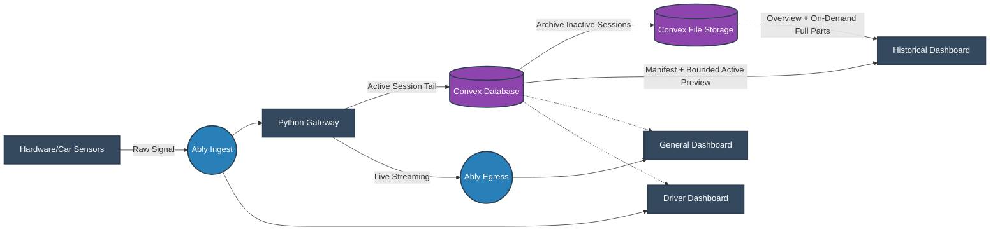

# EcoVolt Telemetry Dashboard

Real-time telemetry monitoring for Shell Eco-marathon vehicles. Built with **SolidJS**, **TypeScript**, and **Convex**.

---

## 🚀 Features

| Category | Features |
|----------|----------|
| **Real-time** | Live streaming via Ably + Convex subscriptions |
| **Visualization** | 11 dashboard panels, 60fps charts, interactive maps |
| **Data** | CSV export, quality metrics, outlier detection |
| **Security** | Role-based access (Guest, External, Internal, Admin) |
| **Design** | Dark theme, glassmorphism, responsive |

---

## 📦 Tech Stack

| Component | Technology |
|-----------|------------|
| Frontend | SolidJS 1.8, TypeScript 5.7 |
| Build | Vite 5.4 |
| Backend | Convex |
| Charts | uPlot 1.6 |
| Maps | MapLibre GL JS 4.1 |
| Tables | TanStack Table 8.17 |

---

## 🛠️ Quick Start

### Prerequisites

- Node.js 18+
- Convex account ([convex.dev](https://convex.dev))
- Ably account ([ably.com](https://ably.com))

### Installation

```bash
# Clone and install
npm install

# Configure environment
cp .env.example .env.local
# Edit .env.local with your Convex URL

# Start development servers
npm run dev          # Frontend (port 3000)
npm run dev:convex   # Convex backend (separate terminal)
```

### Production

```bash
# Build
npm run build

# Deploy Convex
npm run deploy

# Deploy frontend (Vercel)
vercel --prod
```

---

## 🏛️ Architecture


```mermaid
flowchart LR
    classDef node fill:#34495E,stroke:#2C3E50,stroke-width:2px,color:#fff;
    classDef db fill:#8E44AD,stroke:#2C3E50,stroke-width:2px,color:#fff;
    classDef pubsub fill:#2980B9,stroke:#2C3E50,stroke-width:2px,color:#fff;

    ESP32[Hardware/Car Sensors]:::node --> |Raw Signal| AblyIn((Ably Ingest)):::pubsub
    AblyIn --> Bridge[Python Gateway]:::node
    
    Bridge --> |Active Session Tail| Convex[(Convex Database)]:::db
    Convex --> |Archive Inactive Sessions| Files[(Convex File Storage)]:::db
    Bridge --> |Live Streaming| AblyOut((Ably Egress)):::pubsub
    
    AblyOut --> GenUI[General Dashboard]:::node
    AblyIn --> DrvUI[Driver Dashboard]:::node
    Files --> |Overview + On-Demand Full Parts| HistUI[Historical Dashboard]:::node
    Convex --> |Manifest + Bounded Active Preview| HistUI
    
    %% Session Context
    Convex -.-> GenUI
    %% Driver Notifications
    Convex -.-> DrvUI
```
For a comprehensive deep-dive on the architecture and data flow, see [ARCHITECTURE.md](./ARCHITECTURE.md).

---

## 📁 Project Structure

```
src/
├── App.tsx           # Main application entry
├── components/
│   ├── auth/         # Auth (Provider, Modals, UserMenu)
│   ├── charts/       # uPlot charts + configs
│   ├── gauges/       # Canvas gauges
│   ├── layout/       # Header, Tabs, Panel
│   ├── map/          # MapLibre components
│   ├── table/        # TanStack Table
│   └── ui/           # Modal, Toast, Button
├── panels/           # 11 dashboard panels
├── stores/           # SolidJS reactive stores
├── lib/              # Convex client, utilities
└── types/            # TypeScript definitions

convex/
├── schema.ts         # Database schema
├── telemetry.ts      # Telemetry queries/mutations
├── sessions.ts       # Session management
├── archives.ts       # Archive manifest and transactional part commits
├── archiveActions.ts # Gzip file-storage migration
├── archiveValidators.ts # Typed overview and exact-summary contracts
├── crons.ts          # Bounded inactive-session archiver
├── auth.ts           # Authentication
└── users.ts          # User management
```

### Historical archive migration

The archive schema is additive: existing sessions and telemetry documents remain valid. After the Convex functions are deployed, a bounded cron selects at most two sessions that have been inactive for 30 minutes. It writes at most eight 3,000-record gzip parts per session per run and resumes larger sessions on later runs. A source batch is deleted only in the same transaction that commits its durable file-storage manifest, so a failed file write leaves the database copy intact.

Deploy the Convex functions before the updated frontend. During the gradual backfill, historical mode uses small per-part previews plus a bounded database tail; once finalization creates the single overview file, normal session opens become one metadata query and one small compressed download. Archive failures remain visible in `sessions.archive_status` and `sessions.archive_error` and are retried by later bounded runs.

---

## 📊 Dashboard Panels

| Panel | Description |
|-------|-------------|
| **Overview** | Gauges + G-force scatter + stats |
| **Speed** | Speed/acceleration analysis |
| **Power** | Power/voltage/current charts |
| **IMU** | Sensor data visualization |
| **Efficiency** | Energy trends + optimal speed |
| **GPS** | Interactive map + altitude |
| **Data** | Raw table + CSV export |
| **Quality** | Data completeness + outliers |
| **Sessions** | Session history |
| **Custom** | User-defined widgets |
| **Admin** | User management |

---

## 🔐 User Roles

| Role | Real-time | Historical | CSV | Admin |
|------|-----------|------------|-----|-------|
| Guest | ✅ | ❌ | ❌ | ❌ |
| External | ✅ | Last session (max 1000 representative points) | Up to 1000 points | ❌ |
| Internal | ✅ | ∞ | ∞ | ❌ |
| Admin | ✅ | ∞ | ∞ | ✅ |

External users do not have access to the Custom Analysis view.

---

## 📚 Documentation

- [ARCHITECTURE.md](./ARCHITECTURE.md) - System architecture and full stack data flow
- [CONVEX_SETUP.md](./CONVEX_SETUP.md) - Backend configuration
- [DEPLOYMENT.md](./DEPLOYMENT.md) - Production deployment
- [TROUBLESHOOTING.md](./TROUBLESHOOTING.md) - Common issues
- [SECURITY.md](./SECURITY.md) - Security considerations

---

## 📝 Scripts

| Command | Description |
|---------|-------------|
| `npm run dev` | Start Vite dev server |
| `npm run dev:convex` | Start Convex dev server |
| `npm run build` | Production build |
| `npm run preview` | Preview production |
| `npm run deploy` | Deploy Convex |
| `npm run typecheck` | TypeScript check |

---

## 📄 License

MIT License - EcoVolt Shell Eco-marathon Team
