# Shell Eco-marathon Telemetry Dashboard

A real-time telemetry dashboard for monitoring vehicle performance during Shell Eco-marathon competitions. Built with Convex for real-time database and serverless functions, Ably for telemetry streaming, and a modern vanilla JavaScript frontend.

## Quick Links

- **[Quick Start Guide](./QUICKSTART.md)** - Deploy to Vercel in 5 minutes
- **[Deployment Guide](./DEPLOYMENT.md)** - Comprehensive deployment instructions
- **[Convex Setup](./CONVEX_SETUP.md)** - Convex backend setup guide
- **[Security Guide](./SECURITY.md)** - Security best practices
- **[Troubleshooting](./TROUBLESHOOTING.md)** - Common issues and solutions

## Features

- Real-time telemetry monitoring with live gauges and charts
- Historical session playback
- GPS tracking with map visualization
- Power and efficiency metrics
- IMU sensor data visualization
- Data quality analysis with outlier detection
- CSV export functionality
- Authentication & Role-Based Access Control
- User Management Dashboard (Admin)

## User Roles & Permissions

The dashboard supports four user roles with different access levels:

```mermaid
graph TD
    subgraph Role Hierarchy
        A[👑 Admin] --> B[🔒 Internal]
        A --> C[🔓 External]
        A --> D[🎭 Guest]
    end
```



| Feature | Guest | External | Internal | Admin |
|---------|:-----:|:--------:|:--------:|:-----:|
| Live telemetry | ✅ | ✅ | ✅ | ✅ |
| CSV export | ❌ | ≤400 rows | Unlimited | Unlimited |
| History access | ❌ | Last session | All | All |
| User management | ❌ | ❌ | ❌ | ✅ |
| Auto-approved | ✅ | ✅ | ❌ | — |

### Guest (Default)
- View real-time telemetry data
- Cannot download CSV files
- Cannot view historical sessions

### External User
- View real-time telemetry data
- Download CSV (up to 400 data points)
- View last historical session
- Auto-approved on signup

### Internal User
- View real-time telemetry data
- Download unlimited CSV data
- View all historical sessions
- Cannot access admin dashboard
- Requires admin approval

### Admin
- Full access to all features
- User management dashboard
- Approve/reject user requests
- Change user roles

## Tech Stack

- **Backend**: Convex (serverless functions + real-time database)
- **Real-time Streaming**: Ably (for telemetry from ESP32/Python bridge)
- **Database**: Convex Database (NoSQL, automatically indexed)
- **Authentication**: Custom email/password auth in Convex
- **Frontend**: Vanilla JavaScript with uPlot, ECharts, Leaflet, DataTables
- **Deployment**: Vercel (static frontend) + Convex Cloud (backend)

## Architecture

### System Overview


### Data Flow

```mermaid
flowchart LR
    subgraph Realtime["⚡ Real-Time Path"]
        direction LR
        E1[ESP32] -->|JSON| P1[Python Bridge]
        P1 -->|Pub/Sub| A1[Ably]
        A1 -->|WebSocket| D1[Dashboard]
    end

    subgraph Persistence["💾 Persistence Path"]
        direction LR
        P2[Python Bridge] -->|Batch Insert| C1[Convex DB]
        C1 -->|Reactive Query| D2[Dashboard]
    end

    subgraph Historical["📁 Historical Path"]
        direction LR
        D3[Dashboard] -->|Query| C2[Convex]
        C2 -->|Sessions List| D3
        D3 -->|Load Session| Charts2[Playback Charts]
    end
```



### Technology Stack

```mermaid
flowchart TB
    subgraph Frontend["🎨 Frontend - Vercel"]
        HTML[HTML/CSS]
        JS[Vanilla JavaScript]
        uPlot[uPlot Charts]
        ECharts[ECharts]
        Leaflet[Leaflet Maps]
        DataTables[DataTables]
    end

    subgraph Backend["⚙️ Backend - Convex Cloud"]
        Database[(NoSQL Database)]
        ServerlessFn[Serverless Functions]
        AuthSystem[Authentication]
        HTTPApi[HTTP APIs]
        Realtime[Real-time Subscriptions]
    end

    subgraph DataBridge["🔗 Data Bridge - Python"]
        Serial[Serial I/O]
        NumPy[NumPy Processing]
        OutlierDet[Outlier Detection]
        AblySDK[Ably SDK]
        ConvexSDK[Convex SDK]
    end

    Frontend <-->|HTTPS| Backend
    DataBridge -->|Mutations| Backend
    DataBridge -->|Pub/Sub| Frontend
```



## Getting Started

### Prerequisites

- Node.js 18.x or higher
- npm or yarn
- Convex account (free tier at [convex.dev](https://convex.dev))
- Ably account (free tier at [ably.com](https://ably.com))

### Installation

1. Clone the repository:
```bash
git clone https://github.com/ChosF/TelemetryDashboard.git
cd TelemetryDashboard
```

2. Install dependencies:
```bash
npm install
```

3. Set up Convex:
```bash
npx convex dev
```

This will:
- Prompt you to log in to Convex (if needed)
- Create or link to a Convex project
- Deploy your schema and functions
- Start the development watcher

4. Configure your Convex URL in `public/index.html`:
```html
<script>
  window.CONFIG = {
    ABLY_CHANNEL_NAME: "telemetry-dashboard-channel",
    ABLY_API_KEY: "your-ably-api-key",
    CONVEX_URL: "https://your-project.convex.cloud",
  };
</script>
```

5. Set environment variables in Convex dashboard:
   - Go to [dashboard.convex.dev](https://dashboard.convex.dev)
   - Select your project → Settings → Environment Variables
   - Add `ABLY_API_KEY` for token-based authentication

6. Serve the frontend locally:
```bash
# Use any static file server, e.g.:
npx serve public
# or
python -m http.server 8080 -d public
```

The application will be available at `http://localhost:8080`

## Project Structure

```
TelemetryDashboard/
├── public/                 # Static frontend files
│   ├── index.html         # Main HTML file with Convex config
│   ├── app.js             # Frontend application logic
│   ├── auth.js            # Authentication module
│   ├── auth-ui.js         # Authentication UI components
│   ├── styles.css         # Main styling
│   ├── auth-styles.css    # Auth-specific styling
│   └── lib/
│       ├── convex-bridge.js  # Convex client wrapper
│       ├── charts.js         # uPlot chart configurations
│       ├── gauges.js         # Gauge components
│       └── worker-bridge.js  # Web worker for data processing
├── convex/                 # Convex backend
│   ├── schema.ts          # Database schema
│   ├── telemetry.ts       # Telemetry queries and mutations
│   ├── sessions.ts        # Session management
│   ├── users.ts           # User profile management
│   ├── auth.ts            # Authentication functions
│   └── http.ts            # HTTP endpoints (Ably token)
├── backend/
│   └── maindata.py        # Python bridge for ESP32/mock data
├── vercel.json            # Vercel deployment configuration
├── package.json           # Node.js dependencies
└── README.md              # This file
```

## Convex Functions

### Queries (Real-time, Reactive)
- `sessions:listSessions` - List all telemetry sessions
- `telemetry:getSessionRecords` - Get all records for a session
- `telemetry:getRecentRecords` - Get recent records with limit
- `telemetry:getLatestRecord` - Get the most recent record
- `users:getCurrentProfile` - Get current user's profile
- `users:getAllUsers` - Get all users (admin only)

### Mutations
- `telemetry:insertTelemetryBatch` - Insert multiple telemetry records
- `telemetry:deleteSession` - Delete all records for a session
- `users:upsertProfile` - Create or update user profile
- `users:updateUserRole` - Change user role (admin only)
- `auth:signIn` - Sign in or sign up with email/password
- `auth:signOut` - Sign out and invalidate session

### HTTP Endpoints
- `GET /ably/token` - Get Ably authentication token
- `GET /health` - Health check endpoint

## Deployment

### Deploy to Vercel + Convex

1. **Deploy Convex backend:**
```bash
npx convex deploy
```

2. **Deploy frontend to Vercel:**
```bash
vercel --prod
```

3. **Configure environment variables:**
   - In Convex dashboard: Add `ABLY_API_KEY`
   - Update `public/index.html` with production Convex URL

For detailed instructions, see **[DEPLOYMENT.md](./DEPLOYMENT.md)**

## Python Bridge

The Python bridge (`backend/maindata.py`) connects to ESP32 sensors or generates mock data and publishes to both Ably (for real-time) and Convex (for persistence).

### Setup
```bash
pip install convex ably numpy
```

### Configuration
Edit the constants in `maindata.py`:
```python
CONVEX_URL = "https://your-project.convex.cloud"
DASHBOARD_ABLY_API_KEY = "your-ably-api-key"
DASHBOARD_CHANNEL_NAME = "telemetry-dashboard-channel"
```

### Running
```bash
python backend/maindata.py
```

## Local Development

1. Start Convex development server:
```bash
npx convex dev
```

2. Start Python bridge (optional, for mock data):
```bash
python backend/maindata.py
```

3. Serve the frontend:
```bash
npx serve public
```

4. Open `http://localhost:3000` in your browser

## Troubleshooting

### Convex Connection Issues
- Verify `CONVEX_URL` in `public/index.html` is correct
- Ensure `npx convex dev` is running for development
- Check browser console for connection errors

### Ably Connection Issues
- Verify `ABLY_API_KEY` is set correctly
- Check Ably dashboard for account status
- Ensure channel name matches between Python bridge and frontend

### Data Not Appearing
- Check Python bridge console for errors
- Verify Convex deployment is running
- Check Convex dashboard → Data tab to see if records exist

For more solutions, see **[TROUBLESHOOTING.md](./TROUBLESHOOTING.md)**

## License

This project is private and not licensed for public use.

## Support

For questions or issues, please contact a01661298@tec.mx.
