# Security Guidelines

## Overview

This application uses Convex as the backend, which provides built-in security features. This guide outlines the security architecture and best practices.

## Architecture Security

### Convex Security Model

Convex provides several built-in security features:
- **Automatic HTTPS**: All connections are encrypted
- **Authentication**: Built-in session management with secure tokens
- **Authorization**: Role-based access control in mutation/query handlers
- **Input Validation**: Type-safe arguments via Convex validators
- **No SQL Injection**: NoSQL database with type-safe queries

### Data Flow Security

```mermaid
flowchart TB
    subgraph ServerTrust["Server-Side Trust Boundary"]
        subgraph Convex["Convex Cloud"]
            EnvVars["Environment Variables<br/>ABLY_API_KEY (secret)"]
            PwdHash["Password Hashes<br/>SHA-256 + salt"]
            Sessions["Session Tokens<br/>32-byte random hex"]
            AuthChecks["Authorization Checks<br/>• Token validation<br/>• Role verification<br/>• Input sanitization"]
        end
    end

    subgraph ClientBoundary["🌐 Client-Side Boundary"]
        subgraph Browser["Browser"]
            SafeConfig["Safe Config<br/>CONVEX_URL<br/>CHANNEL_NAME"]
            UserToken["Session Token<br/>localStorage"]
            NoAccess["❌ No Access To<br/>API Keys<br/>Passwords<br/>Other Users"]
        end
    end

    ServerTrust <-->|"HTTPS Only<br/>TLS 1.3"| ClientBoundary
```



### Authentication Flow


## Secrets Management

### What Goes Where

| Secret | Storage Location | Exposure |
|--------|-----------------|----------|
| `ABLY_API_KEY` | Convex Environment Variables | Server-side only |
| Session Tokens | localStorage (client), Convex DB (server) | Per-user |
| Password Hashes | Convex `authUsers` table | Server-side only |
| Convex URL | Frontend config | Safe to expose |
| Ably Channel Name | Frontend config | Safe to expose |

### Environment Variables in Convex

Set environment variables in Convex Dashboard:

1. Go to [dashboard.convex.dev](https://dashboard.convex.dev)
2. Select your project
3. Navigate to Settings → Environment Variables
4. Add variables (they're only accessible in server-side functions)

### Frontend Configuration

The frontend config in `public/index.html` contains only safe-to-expose values:

```javascript
window.CONFIG = {
  ABLY_CHANNEL_NAME: "telemetry-dashboard-channel",  // Safe
  ABLY_AUTH_URL: "/ably/token",                      // Safe - URL only
  CONVEX_URL: "https://your-project.convex.cloud",   // Safe
};
```

**Never include in frontend config:**
- `ABLY_API_KEY` (use `ABLY_AUTH_URL` instead)
- Database credentials
- Service account keys

## Authentication Security

### Password Storage

Passwords are hashed using SHA-256 with a salt before storage:

```typescript
// In convex/auth.ts
async function hashPassword(password: string): Promise<string> {
  const encoder = new TextEncoder();
  const data = encoder.encode(password + "ecovolt-salt-v1");
  const hashBuffer = await crypto.subtle.digest("SHA-256", data);
  // ... convert to hex string
}
```

**Note**: For production systems handling sensitive data, consider upgrading to bcrypt or Argon2.

### Session Management

- Sessions are stored in Convex with secure random tokens
- Tokens expire after 24 hours
- Tokens are validated on every authenticated request
- Sign out invalidates the session server-side

### Token Security

```javascript
// Token format: 64-character hex string (32 random bytes)
// Example: "a1b2c3d4e5f6..."

// Storage: localStorage (client-side)
localStorage.setItem('convex_auth_token', token);

// Transmission: Passed as argument to Convex functions
await ConvexBridge.getCurrentProfile(token);
```

## Authorization

### Role-Based Access Control

```mermaid
flowchart LR
    subgraph Roles["User Roles (Increasing Privileges →)"]
        Guest["🎭 Guest<br/>Default role"]
        External["🔓 External<br/>Auto-approved"]
        Internal["🔒 Internal<br/>Requires approval"]
        Admin["👑 Admin<br/>Full access"]
    end

    Guest --> External --> Internal --> Admin
```



| Feature | Guest | External | Internal | Admin |
|---------|:-----:|:--------:|:--------:|:-----:|
| Live telemetry | ✅ | ✅ | ✅ | ✅ |
| CSV export | ❌ | ≤400 | Unlimited | Unlimited |
| Historical sessions | ❌ | Last only | All | All |
| Admin panel | ❌ | ❌ | ❌ | ✅ |

Four user roles with increasing privileges:

| Role | Capabilities |
|------|-------------|
| `guest` | View real-time data only |
| `external` | + Download limited CSV, view last session |
| `internal` | + Unlimited CSV, all sessions |
| `admin` | + User management, approve requests |

### Server-Side Authorization

Authorization is checked in Convex functions:

```typescript
// Example from convex/users.ts
export const getAllUsers = query({
  args: { token: v.optional(v.string()) },
  handler: async (ctx, args) => {
    // Verify token and get user ID
    const userId = await getCurrentUserId(ctx, args.token);
    if (!userId) return [];

    // Check role
    const profile = await ctx.db.query("user_profiles")
      .withIndex("by_userId", q => q.eq("userId", userId))
      .first();

    if (profile?.role !== "admin") {
      return [];  // Non-admins get empty result
    }

    // Admin gets all users
    return await ctx.db.query("user_profiles").collect();
  },
});
```

## Best Practices

### Do

1. **Use ABLY_AUTH_URL for token authentication**
   - More secure than exposing API key in frontend
   - Tokens are short-lived and can be revoked

2. **Validate all inputs server-side**
   - Convex validators handle this automatically
   - Never trust client-side validation alone

3. **Check authorization in every mutation/query**
   - Verify user has permission for the operation
   - Don't rely on UI hiding features

4. **Use HTTPS everywhere**
   - Convex and Vercel provide this automatically
   - Ensure Python bridge uses HTTPS URLs

5. **Keep secrets in environment variables**
   - Convex environment variables for backend
   - Never commit secrets to git

6. **Rotate credentials periodically**
   - Update Ably API keys
   - Force password resets if compromised

### Don't

1. **Never expose ABLY_API_KEY in frontend**
   - Use token authentication via Convex HTTP endpoint

2. **Never log sensitive data**
   - Don't log passwords, tokens, or API keys
   - Mask values if debugging is necessary

3. **Never trust client-side data**
   - Validate everything server-side
   - Re-check permissions in Convex functions

4. **Never store plain-text passwords**
   - Always hash with salt

5. **Never bypass authorization checks**
   - Even for "read-only" queries

## HTTP Endpoint Security

The Convex HTTP endpoint (`convex/http.ts`) includes:

### CORS Headers

```typescript
const corsHeaders = {
  "Access-Control-Allow-Origin": "*",  // Consider restricting in production
  "Access-Control-Allow-Methods": "GET, POST, OPTIONS",
  "Access-Control-Allow-Headers": "Content-Type, Authorization",
  "Access-Control-Max-Age": "86400",
};
```

**Production Recommendation**: Restrict `Access-Control-Allow-Origin` to your domain.

### Ably Token Endpoint

The `/ably/token` endpoint:
1. Reads `ABLY_API_KEY` from Convex environment variables
2. Generates a signed token request
3. Returns token to client (never the API key)

## Vercel Security Headers

The `vercel.json` includes security headers:

```json
{
  "headers": [
    {
      "source": "/(.*)",
      "headers": [
        { "key": "X-Content-Type-Options", "value": "nosniff" },
        { "key": "X-Frame-Options", "value": "DENY" },
        { "key": "X-XSS-Protection", "value": "1; mode=block" }
      ]
    }
  ]
}
```

## Incident Response

If credentials are compromised:

### 1. Immediately Rotate Credentials

**Ably API Key:**
1. Go to Ably Dashboard → Your App → API Keys
2. Create new key, update Convex environment variable
3. Revoke old key

**User Sessions:**
1. In Convex Dashboard → Data → `authSessions`
2. Delete all sessions to force re-login

### 2. Review Logs

- Check Convex logs for unauthorized access
- Review Ably stats for unusual activity
- Check Vercel function logs

### 3. Notify Users

If user data may be compromised:
- Force password resets
- Notify affected users

## Security Checklist

Before going to production:

- [ ] `ABLY_API_KEY` stored in Convex environment variables only
- [ ] Frontend uses `ABLY_AUTH_URL`, not raw API key
- [ ] No secrets in git repository
- [ ] All Convex mutations check authorization
- [ ] Password hashing implemented
- [ ] Session expiry configured
- [ ] CORS restricted to your domain (optional but recommended)
- [ ] Security headers configured in Vercel
- [ ] First admin user created through secure process
- [ ] Audit logging enabled (Convex logs)

## Contact

For security issues, contact the repository maintainer.

---

*Last updated: January 2026*
