# Convex Backend - EcoVolt Telemetry Dashboard

This directory contains the Convex serverless backend for the EcoVolt Telemetry Dashboard.

## Architecture

```mermaid
flowchart TB
    subgraph ConvexDir["📦 convex/"]
        schema["schema.ts<br/><i>Database tables</i>"]
        telemetry["telemetry.ts<br/><i>Telemetry CRUD</i>"]
        sessions["sessions.ts<br/><i>Session management</i>"]
        users["users.ts<br/><i>User profiles</i>"]
        auth["auth.ts<br/><i>Authentication</i>"]
        http["http.ts<br/><i>HTTP endpoints</i>"]
    end

    subgraph Tables["📊 Tables"]
        T1[(telemetry)]
        T2[(authUsers)]
        T3[(authSessions)]
        T4[(user_profiles)]
    end

    schema --> Tables
    telemetry --> T1
    auth --> T2
    auth --> T3
    users --> T4
```



### Module Responsibilities

| File | Purpose | Key Functions |
|------|---------|---------------|
| `schema.ts` | Database tables | telemetry, authUsers, authSessions, user_profiles |
| `telemetry.ts` | Telemetry CRUD | getSessionRecords, insertTelemetryBatch, deleteSession |
| `sessions.ts` | Session listing | listSessions |
| `users.ts` | User management | getCurrentProfile, getAllUsers, updateUserRole |
| `auth.ts` | Authentication | signIn, signOut, verifySession |
| `http.ts` | HTTP endpoints | /ably/token, /health |

## Files Overview

| File | Purpose |
|------|---------|
| `schema.ts` | Database schema definitions |
| `telemetry.ts` | Telemetry data queries and mutations |
| `sessions.ts` | Session listing and management |
| `users.ts` | User profile management |
| `auth.ts` | Email/password authentication |
| `http.ts` | HTTP endpoints (Ably token, health check) |
| `config.ts` | Configuration queries |

## Schema

### Tables

- **telemetry** - Vehicle sensor data (speed, power, GPS, IMU, etc.)
- **authUsers** - User credentials (email, password hash)
- **authSessions** - Active login sessions
- **user_profiles** - User roles and permissions

## Key Functions

### Queries (Real-time, Reactive)

```typescript
// Get all records for a session
telemetry:getSessionRecords({ sessionId: string })

// Get recent records with limit
telemetry:getRecentRecords({ sessionId: string, limit?: number, sinceTimestamp?: string })

// List all sessions
sessions:listSessions({})

// Get user profile
users:getCurrentProfile({ token: string })
```

### Mutations

```typescript
// Insert telemetry data batch
telemetry:insertTelemetryBatch({ records: [...] })

// Delete a session
telemetry:deleteSession({ sessionId: string })

// Update user role (admin only)
users:updateUserRole({ token: string, targetUserId: Id, role: string })
```

### Actions

```typescript
// Sign in or sign up
auth:signIn({ params: { email, password, flow?: "signUp" } })

// Sign out
auth:signOut({ token: string })
```

## HTTP Endpoints

- `GET /ably/token` - Generate Ably authentication token
- `GET /health` - Health check

## Development

```bash
# Start development server (watches for changes)
npx convex dev

# Deploy to production
npx convex deploy

# View logs
# Go to dashboard.convex.dev → Your Project → Logs
```

## Environment Variables

Set in Convex Dashboard → Settings → Environment Variables:

| Variable | Description |
|----------|-------------|
| `ABLY_API_KEY` | Ably API key for token generation |

## Data Flow

```mermaid
flowchart TB
    subgraph Write["✍️ Write Path"]
        PB[Python Bridge] -->|insertTelemetryBatch| Mut[Mutation]
        Mut -->|Insert| DB[(Telemetry Table)]
    end

    subgraph Reactive["⚡ Reactive System"]
        DB -->|Auto-notify| Sub[Subscriptions]
    end

    subgraph Read["📖 Read Path"]
        Sub -->|Live Updates| Query[getSessionRecords]
        Query -->|Data| Dashboard[Dashboard Charts]
    end
```



> **Key Insight**: Convex queries are **REACTIVE** - when data changes, subscribed clients automatically receive updates. No polling needed!

## Resources

- [Convex Documentation](https://docs.convex.dev)
- [Convex TypeScript API](https://docs.convex.dev/api)
- [Convex Discord](https://discord.gg/convex)
